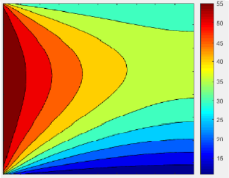

# Implementing and Simulating 2 Dimensional Diffusion (2017)
Simulating 2 Dimensional temperature distribution on a plate using the finite volume method to discretize the diffusion equation and the Gauss-Seidel iterative method for solving the systems' equations.

results video animation (https://youtu.be/bFFg4KAUqos)

Temperature rise with time.

## Introduction
The Diffusion equation is a Partial Differential Equation that describes the phenomenon of diffusion, The Diffusion Equation is a general equation, and in the simplest form, can be stated simply as the following:

The change in a specific property with respect to time is proportional to the change of the same property with respect to space with the proportionality constant being the Diffusion Constant.

The diffusion equation’s generality comes from the sense that it's applicable to various types of propagations, one of its most used applications is heat diffusion, and in this case it’s well known as the heat equation.

We discretize the Diffusion Equation above using the Finite Volume Method, this is achieved by first Integrating the general equation over the volume we’re working on, in this case a 3 dimensional plate with thickness dz, for simplicity we assumed unit thickness.

Skipping through the steps we get this equation:

## Results

The plate was heated from the north by a source with 30°C temperature, from the south by a source with 10°C, from the west by a source with 60° temperature, and it was insulated from the eastern side.

4 Meshes were experimented on, 50x50, 100x100, 250x250, and 1000x1000, the more nodes we put in the mesh the longer the time it took for the simulation to finish, the 1000x1000 mesh took 5 hours to complete on a core i3 processor.

Resulting Temperature distribution at equilibrium:

## Comparison of The Temperature Profiles Taken from a Central Horizontal Line from the Three Meshes(50,100,250)

## Simulation Time and Minimum Temperature for Each Mesh

